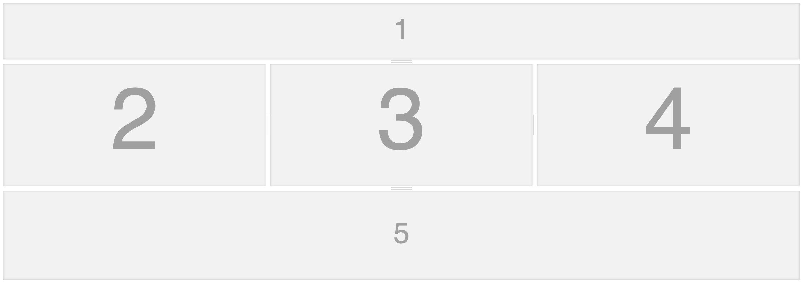

# Svelte-Splitpanes

[](https://www.npmjs.com/package/svelte-splitpanes)

[](https://orefalo.github.io/svelte-splitpanes/minified-size)


A _predictable_ responsive component to layout resizable view panels supporting an multitude of advanced features (min/max bounderies, snap, expand on double click, fixed size, rtl).



## Why?

_"To be sucessful, a good framework must come with good components."_

Unfortunatly, we couldn't find any decent splitpane widget in the Svelte eco-system.
But we did find one written for vue.js...

> This library started as a port of [vue-splitpanes](https://antoniandre.github.io/splitpanes/) and through feature enhancements, became one of the best splitpane implementation.

Special thanks to all contributors and in particular [Tal500](https://github.com/Tal500)

## Features

- Support both dynamic horizontal and vertical splits
- Support defaults, min and max sizes
- Support multiple splits
- Support lifecyle events
- Support custom divider size and overlay (css)
- Support splitter pane pushing
- Support RTL rendering with auto-detection
- Support first splitter on/off
- Support pane toggle
- Support edge snapping
- Support programmatic resizing and two-way size binding
- Support programmatic panes add/remove
- Support programmatic panes reordering by Svelte keyed each blocks
- Support for legacy browser such as IE 11
- Support for touch devices
- Support for fixed splitters
- Sveltekit & Typescript friendly

## Browser Support

|  |  |  |  |  |  |
| ---------------------------------------------------------------------------------------- | ------------------------------------------------------------------------------------------- | ---------------------------------------------------------------------------------------- | ------------------------------------------------------------------------------------- | ---------------------------------------------------------------------------------- | ---------------------------------------------------------------------------------------------------------------------------- |
| Latest ✔                                                                                | Latest ✔                                                                                   | Latest ✔                                                                                | Latest ✔                                                                             | Latest ✔                                                                          | 11 ✔                                                                                                                        |

## Star History

[](https://star-history.com/#orefalo/svelte-splitpanes&Date)

## Demo & Documentation

- [REPL Demo](https://svelte.dev/repl/1e96cbd4bcd148e3b85a4c8ca76d7309)
- [More complex demos and examples](https://orefalo.github.io/svelte-splitpanes/)

## Installation

```shell
$ npm i svelte-splitpanes
```

## Usage

```svelte
<script>
  import { Pane, Splitpanes } from 'svelte-splitpanes';
</script>

<Splitpanes style="height: 400px">
  <Pane minSize={20}>
    1
    <br />
    <em class="specs">I have a min width of 20%</em>
  </Pane>
  <Pane>
    <Splitpanes horizontal={true}>
      <Pane minSize={15}>
        2
        <br />
        <em class="specs">I have a min height of 15%</em>
      </Pane>
      <Pane>3</Pane>
      <Pane>4</Pane>
    </Splitpanes>
  </Pane>
  <Pane>5</Pane>
</Splitpanes>
```

### API

Here is the list of properties that apply to `<Splitpanes>`

| Parameter name   | Type            | Default                     | Comments                                                                                                                                                               |
| ---------------- | --------------- | --------------------------- | ---------------------------------------------------------------------------------------------------------------------------------------------------------------------- |
| horizontal       | boolean         | false (Vertical by default) | The orientation of the split panes.                                                                                                                                    |
| pushOtherPanes   | boolean         | true                        | Whether a splitter should push the next splitter when dragging.                                                                                                        |
| dblClickSplitter | boolean         | true                        | Double click on splitter to maximize the next pane                                                                                                                     |
| rtl              | boolean\|"auto" | "auto"                      | Supports Right to left, by default will auto detect                                                                                                                    |
| firstSplitter    | boolean         | false                       | Displays the first splitter when set to true. This allows maximizing the first pane on splitter double click                                                           |
| id               | string          | undefined                   | Provide an optional id attribute to the component for styling/other reasons                                                                                            |
| theme            | string          | 'default-theme'             | Used to styles the splitters using a different css class, if different then the default value 'default-theme'. see the styling examples in the demo site for more info |
| class            | string          | undefined                   | Any additional css classes to be added to the component                                                                                                                |

Properties that apply to `<Pane>`

| Parameter name | Type         | Default     | Comments                                                |
| -------------- | ------------ | ----------- | ------------------------------------------------------- |
| minSize        | number       | 0           | minimum pane size constraint in %                       |
| maxSize        | number       | 100         | maximum pane size constraint in %                       |
| size           | number\|null | null        | pane size in %, will autosize if not defined            |
| snapSize       | number       | 0(disabled) | edge snap size constraint in %                          |
| class          | string       | undefined   | any additional css classes to be added to the component |

### Styling

The component can be further styled after the props have been defined by overriding the default css styling. The best way to do this is to use a class differenciator or the id="" prop and then scope your global css with this class/id.

```css
/* The following classes can be used to style the splitter, see demos*/

.splitpanes {
  background-color: #f8f8f8;
}

.splitpanes__splitter {
  background-color: #ccc;
  position: relative;
}
.splitpanes__splitter:before {
  content: '';
  position: absolute;
  left: 0;
  top: 0;
  transition: opacity 0.4s;
  background-color: rgba(255, 0, 0, 0.3);
  opacity: 0;
  z-index: 1;
}
.splitpanes__splitter:hover:before {
  opacity: 1;
}
.splitpanes--vertical > .splitpanes__splitter:before {
  left: -30px;
  right: -30px;
  height: 100%;
}
.splitpanes--horizontal > .splitpanes__splitter:before {
  top: -30px;
  bottom: -30px;
  width: 100%;
}
```

### Events

The component raises the following events:

| name             | description                                                                                                 | data                                                                                                                                                                       |
| ---------------- | ----------------------------------------------------------------------------------------------------------- | -------------------------------------------------------------------------------------------------------------------------------------------------------------------------- |
| `ready`          | fires when splitpanes is ready                                                                              | none                                                                                                                                                                       |
| `resize`         | fires while resizing (on mousemove/touchmove)                                                               | returns an array of all the panes objects with their dimensions                                                                                                            |
| `resized`        | fires once when the resizing stops after user drag (on mouseup/touchend) or when adding or removing a pane. | returns an array of all the panes objects with their dimensions                                                                                                            |
| `pane-click`     | when clicking (or touching) a pane                                                                          | returns the clicked pane object with its dimensions                                                                                                                        |
| `pane-maximize`  | fires when the pane is maximized (ie. typically by double clicking the splitter)                            | returns the maximized pane object with its dimensions                                                                                                                      |
| `pane-add`       | fires when a pane is added                                                                                  | returns an object containing the index of the added pane and the new array of panes after resize                                                                           |
| `pane-remove`    | fires when a pane is removed                                                                                | returns an object containing the removed pane and an array of all the remaining pane objects with their dimensions (after resize)                                          |
| `splitter-click` | fires when you click a splitter                                                                             | returns the next pane object (with its dimensions) directly after the clicked splitter. This event is only emitted if dragging did not occur between mousedown and mouseup |

Events are easy to trap

```svelte
<script>
  import { Splitpanes } from 'svelte-splitpanes';

  function handleMessage(event) {
    console.log(JSON.stringify(event));
  }
</script>

<Splitpanes
  on:ready={handleMessage}
  on:resize={handleMessage}
  on:resized={handleMessage}
  on:pane-click={handleMessage}
  on:pane-maximize={handleMessage}
  on:pane-add={handleMessage}
  on:pane-remove={handleMessage}
  on:splitter-click={handleMessage} />
```

## Contributing

If you have a great feature, feel free to open a discussion on GitHub to discuss the ideae, you may also fork Splitpanes and submit your changes back as a PR.

### Building

We recommend to use `pnpm` package manager as it is tightly integrated with our CICD pipeline.

To setup (or update) the project, process as such:

1. Install PNPM (if not already installed), for example via `npm install -g pnpm`
2. Run `pnpm install`

To build the exported library, run `pnpm package`.

To build the docs for production-ready version, you need to run `pnpm build`, and you may display the result by `pnpm preview`.

### Developing

After setting (or update) the environment (discussed in the previous section), you may also excecute SvelteKit in development mode by running `pnpm dev`. This will open a Vite server that automatically changes the result in the browser when the code is updated.

### Commiting changes

- run `pnpm commit`

We have very precise rules over how our git commit messages are formatted. This leads to **more readable messages** that are easy to follow when looking through the **project history**. We use the git messages to **auto-generate the change log**.

Commits are accepted, as long as they comply to the _commit message format_ described below.

When you push your commits to Github (by a PR or directly to the repo), your code will be verfied again by Github Actions with code formatting and linting checks. be sure to properly use `pnpm format` and `pnpm lint`

To ease the development and to enforce the process of formatting the code, perform checks and formatting the commit message, you're advised to commit using the following steps:

0. Make sure your environment is up to date, by running periodically `pnpm install`.
1. Make sure that all the relevant changes are staged.
2. (Optional) Run `pnpm build && pnpm test` to execute Playwright tests.
3. Run `pnpm commit`.
   - If linting or svelte checks are failed, the commit process will abort and you'll have to fix them.
   - Otherwise, you will procceed to the commitment interactive terminal, and just follow the instructions to commit your changes.

#### Commit Message Format

Each commit message consists of a **header**, a **body** and a **footer**. The header is _mandatory_ and has a special format that includes a **type**, a **subject** and an optional **scope** :

```
type(scope?)!?: subject
body?
footer?
```

Any line of the commit message cannot be longer than 100 characters. This allows the message to be easy to read on GitHub and various other git tools.

###### Type

Must be one of the following:

- **build**: Changes that affect the build system or external dependencies (example scopes: npm)
- **ci**: Changes to the CI configuration files and scripts
- **docs**: Documentation only changes
- **feat**: A new feature, increments X.9.X
- **fix**: A bug fix, increments X.X.9
- **wip**: To mark a work in progress
- **perf**: A code change that improves performance
- **refactor**: A code change that neither fixes a bug nor adds a feature
- **style**: Changes that do not affect the meaning of the code (white-space, formatting, missing semicolons, etc.)
- **test**: Adding missing tests or correcting existing tests
- **revert:** for a revert commit

adding a tailing **'!'** marks the commit as a **BREAKING CHANGE** - and will affect version numbering.

###### Subject

The subject contains a succinct description of the change:

- use the imperative, present tense: "change" not "changed" nor "changes"
- don't capitalize the first letter
- no dot (.) at the end

### GH Pages (demo site)

GH Pages hold the demo site. The pages are automatically generated by every push to `master`.

### Publishing a new release

The source code releasing cycle works by the automated bot [Release Please](https://github.com/googleapis/release-please).

Every time a new important commit is merged to master, this bot will create/update a PR for a new version proposal, containing an updated `CHANGELOG.md` file and an increased version number for the next release.

When a maintainer wish to publish a new release, he must perform the following tasks, **in this specific order**:

0. Merge all the relevant changes to master, and make sure that all Github actions checks passed and the auto-generated docs are fine.
1. Create a source code release, simply by merging the PR created by the Release Please bot. You have a chance right before the merging to modify the changelog: Modifying the PR body will change what will be displayed on the Github release page, and modifying the file changes to the `CHANGELOG.md` file of the PR let you change the automated changes to this file. **Important**: If you don't merge this release PR immediately after your manual modifications, your modifications will be lost by the next invocation of the Release Please action, which executes whenever committing to the master branch.
2. After the merging, wait until the Github Actions job named `release-please` is done. You should see now an auto-generated Github release on the main Github page, containing the compiled package with the source code (no need to download it manually).
3. Fetch the changes from **master** and publish to NPM the newly auto-generated release, by executing the following: (get the `NPM_OTP` from Google authenticator ):

```shell
$ pnpm login https://registry.npmjs.org/
$ git checkout master
$ git fetch
$ pnpm fetch-and-publish <NPM_OTP>
```

The purpose of this process is to streamline the release process, free from any human mistakes.

We run step 3 manually, and not automated on Github Actions, because we don't want to share NPM credentials as part of the Github project.

### More control about Release Please

#### Controling the version number and forcing a release PR

**Release Please** actions follows semantic versioning to generate the version number. If you want to change the version number of the new release, or that Release Please bot didn't generate a PR (because there is no _important_ change) and you want to force a new version, you may bump(or downgrade) the version by adding a new commit (replacing `VERSION` to a version number in the format of `X.Y.Z`):

```shell
git commit --allow-empty -m "chore: release VERSION (you may change the title)" -m "Release-As: VERSION"
```

Source: https://github.com/googleapis/release-please#how-do-i-change-the-version-number

#### Controlling contribution PR

You can specify additional messages in the PR body that will be included in the changelog (if relevant). An example to a body of PR containing additional messages:

```
feat: adds v4 UUID to crypto

This adds support for v4 UUIDs to the library.

fix(utils): unicode no longer throws exception
  PiperOrigin-RevId: 345559154
  BREAKING-CHANGE: encode method no longer throws.
  Source-Link: googleapis/googleapis@5e0dcb2

feat(utils): update encode to support unicode
  PiperOrigin-RevId: 345559182
  Source-Link: googleapis/googleapis@e5eef86
```

Source: https://github.com/googleapis/release-please#what-if-my-pr-contains-multiple-fixes-or-features

In the case that a contribution PR was already merged and you want to change the messages for release please, you can edit the body of the merged pull requests and add a section like:

```
BEGIN_COMMIT_OVERRIDE
feat: add ability to override merged commit message

fix: another message
chore: a third message
END_COMMIT_OVERRIDE
```

Source: https://github.com/googleapis/release-please#how-can-i-fix-release-notes
